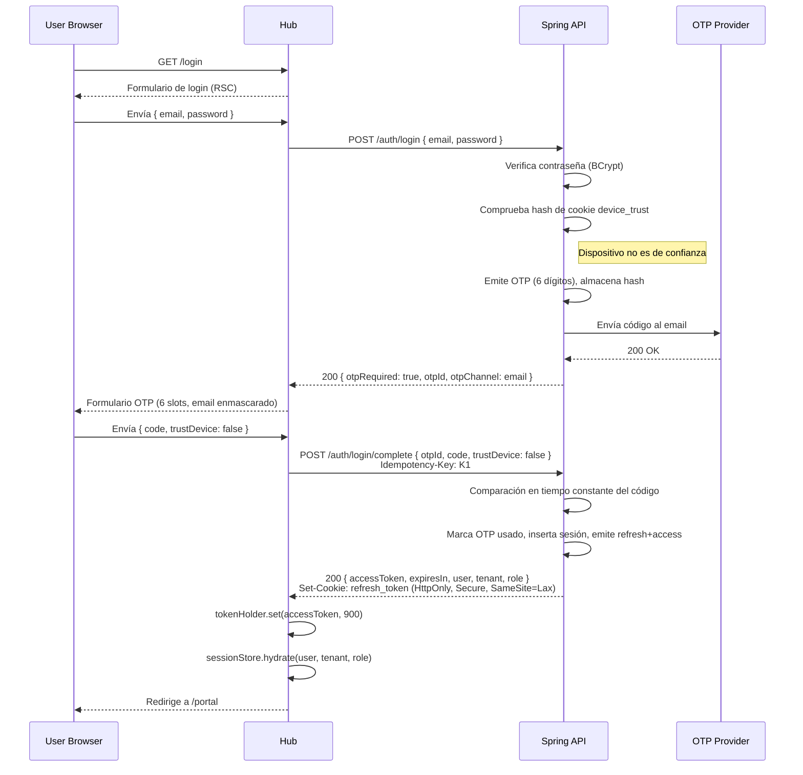
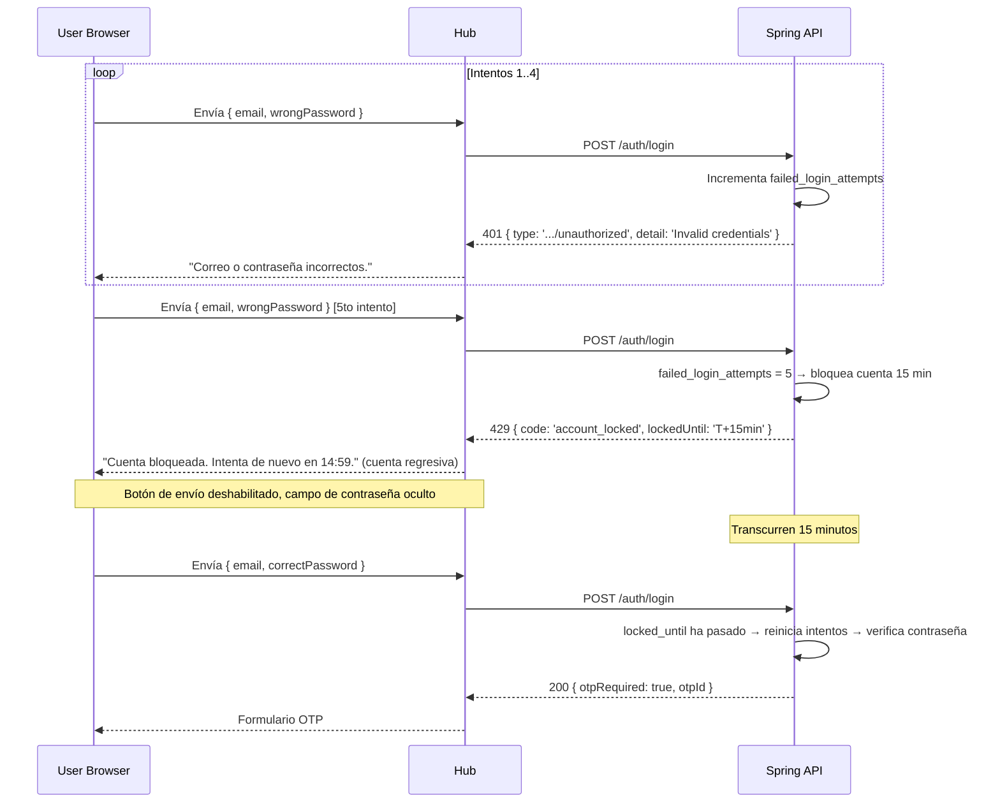
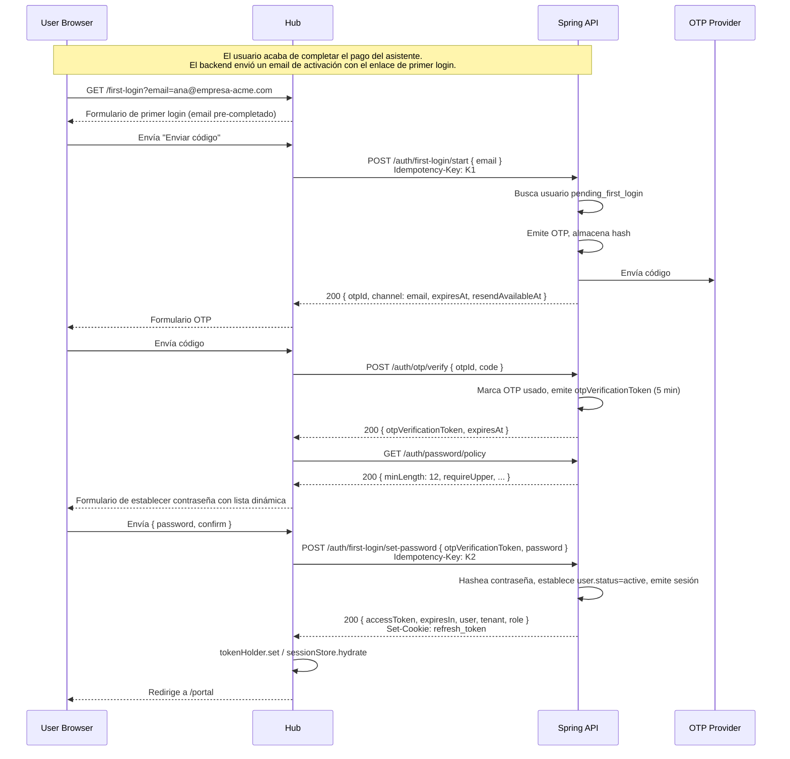
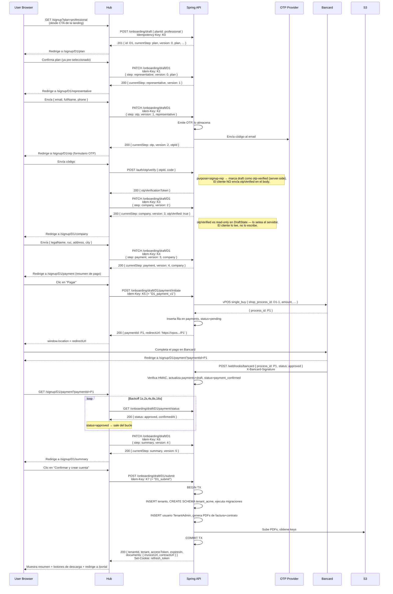
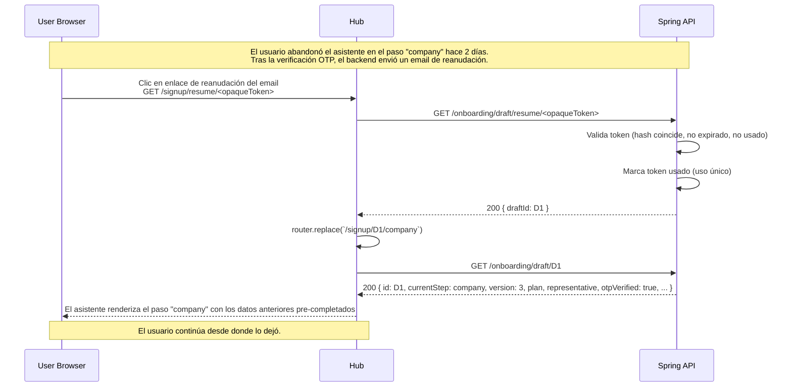
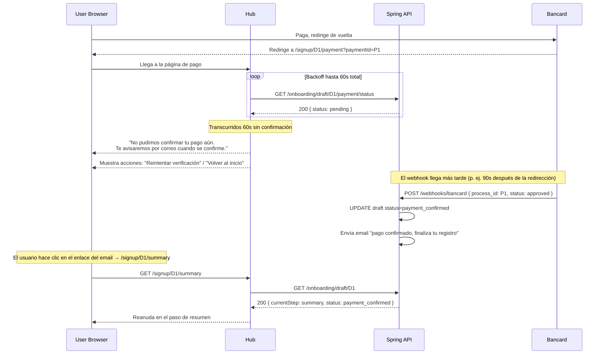
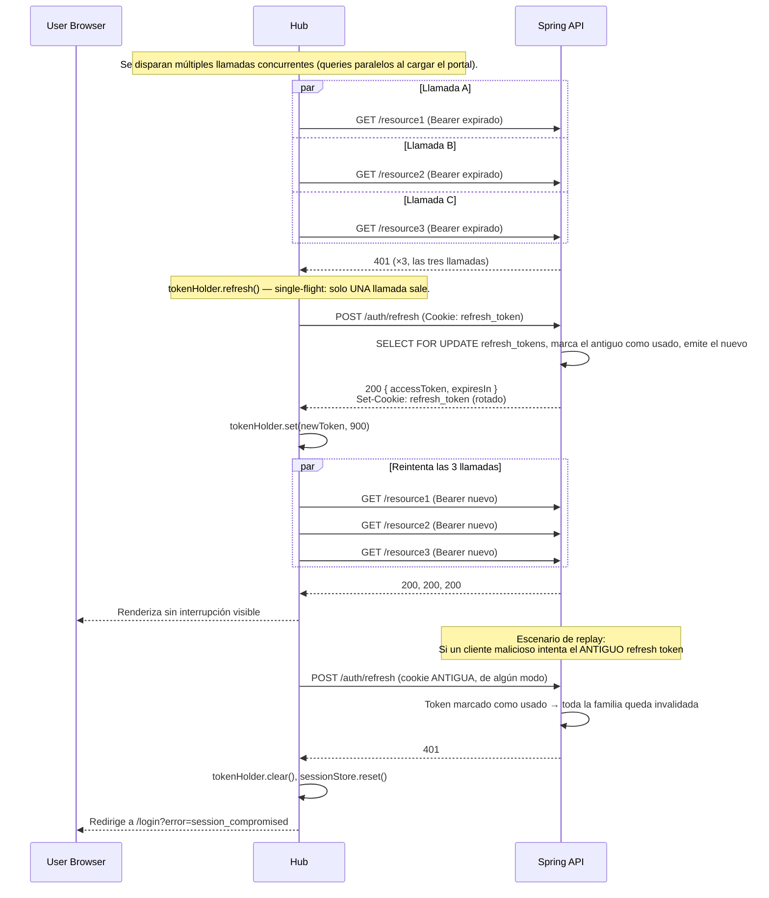
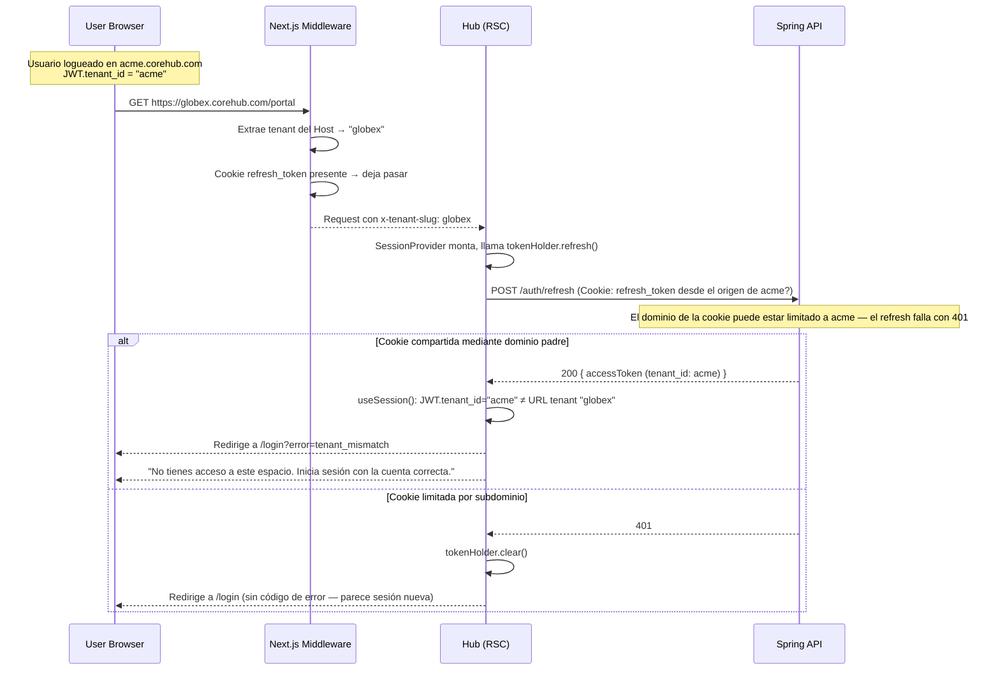

# Diagramas de Secuencia — tenant-onboarding-auth

> Formato Mermaid. Renderizar en cualquier visor de Markdown con soporte Mermaid
> (GitHub, plugin de VSCode, Mermaid Live).

## Actores

- **U** — User Browser
- **H** — Hub (Next.js, `apps/hub`)
- **A** — Spring Boot API
- **OTP** — OTP Provider (SendGrid/Twilio)
- **B** — Bancard vPOS
- **S3** — S3 Object Storage

---

## 1. Login (usuario recurrente) — flujo feliz



---

## 2. Login — contraseña incorrecta + bloqueo



---

## 3. Primer login (representante del asistente) — flujo completo



---

## 4. Primer login (usuario invitado) — aceptar + establecer contraseña

```mermaid
sequenceDiagram
    participant U as User Browser
    participant H as Hub
    participant A as Spring API

    U->>H: GET /invite/<token>
    H->>A: GET /invitations/<token>
    A->>A: Valida token (hash coincide, no expirado, no usado)
    A-->>H: 200 { email, tenantName, inviterName, role: User, expiresAt, status: pending }
    H-->>U: "Hola, has sido invitado a [Empresa] por [Invitador]."

    U->>H: Clic en "Aceptar invitación"
    H->>A: GET /auth/password/policy
    A-->>H: 200 { minLength: 12, ... }
    H-->>U: Formulario de establecer contraseña

    U->>H: Envía { password }
    H->>A: POST /invitations/<token>/accept { password }<br/>Idempotency-Key: K1
    A->>A: Marca token usado; crea usuario; hashea contraseña; emite sesión
    A-->>H: 200 { accessToken, expiresIn, user, tenant, role: User }<br/>Set-Cookie: refresh_token
    H->>H: tokenHolder.set / sessionStore.hydrate
    H-->>U: Redirige a /portal
```

---

## 5. Registro con asistente — flujo feliz completo con pago



---

## 6. Reanudación del asistente por email



---

## 7. Pago (Bancard) — iniciar → redirigir → webhook → polling → confirmación

```mermaid
sequenceDiagram
    participant U as User Browser
    participant H as Hub
    participant A as Spring API
    participant B as Bancard

    U->>H: Clic en "Pagar"
    H->>H: Genera idem key K = "D1_payment_v1", persiste en localStorage
    H->>A: POST /onboarding/draft/D1/payment/initiate<br/>Idempotency-Key: K
    A->>A: Valida estado del borrador (=otp_verified o company)
    A->>B: vPOS single_buy { shop_process_id: D1-1, amount, currency }
    B-->>A: { process_id: P1 }
    A->>A: INSERT payments(P1, draft=D1, status=pending)
    A-->>H: 200 { paymentId: P1, redirectUrl: 'https://vpos.../checkout/new/P1' }
    H->>U: window.location = redirectUrl

    U->>B: Datos de tarjeta, 3DS, etc.
    par Webhook (servidor a servidor)
        B->>A: POST /webhooks/bancard { process_id: P1, status: approved }<br/>X-Bancard-Signature: <hmac>
        A->>A: Valida HMAC, idempotente en (process_id, status)
        A->>A: UPDATE payments set status=approved, confirmedAt=NOW()
        A->>A: UPDATE draft set status=payment_confirmed
        A-->>B: 200 OK
    and Redirección del navegador
        B-->>U: Redirige a /signup/D1/payment?paymentId=P1
    end

    U->>H: GET /signup/D1/payment?paymentId=P1
    loop Backoff exponencial 1s,2s,4s,8s,16s; máx 60s
        H->>A: GET /onboarding/draft/D1/payment/status
        alt webhook llegó primero
            A-->>H: 200 { status: approved, confirmedAt }
            Note over H: Sale del bucle
        else aún pendiente
            A-->>H: 200 { status: pending }
            Note over H: Espera el siguiente intervalo
        end
    end
    H-->>U: "Pago confirmado" + avanza al resumen
```

---

## 8. Timeout de pago — webhook con retraso



---

## 9. Refresh silencioso del JWT en 401



---

## 10. Cierre de sesión (broadcast multi-pestaña)

```mermaid
sequenceDiagram
    participant T1 as Tab 1
    participant T2 as Tab 2
    participant T3 as Tab 3
    participant BC as BroadcastChannel('corehub-auth')
    participant A as Spring API

    Note over T1,T3: El usuario tiene Hub abierto en 3 pestañas (mismo origen).

    T1->>T1: Clic en "Cerrar sesión"
    T1->>A: POST /auth/logout<br/>Idempotency-Key: K
    A->>A: Invalida la familia de refresh token<br/>Set-Cookie: refresh_token=; Max-Age=0
    A-->>T1: 204
    T1->>T1: tokenHolder.clear(), sessionStore.reset()
    T1->>BC: postMessage({ type: 'sign-out' })
    T1-->>T1: Redirige a /login

    par Oyentes
        BC-->>T2: { type: 'sign-out' }
        T2->>T2: tokenHolder.clear(), sessionStore.reset()
        T2-->>T2: Redirige a /login (sin llamada API necesaria)
    and
        BC-->>T3: { type: 'sign-out' }
        T3->>T3: tokenHolder.clear(), sessionStore.reset()
        T3-->>T3: Redirige a /login
    end
```

---

## 11. Discrepancia de tenant en resolución → 403



---

## Notas

- Todos los diagramas asumen `tenant-mode=subdomain` para producción. En modo `path`
  el prefijo de URL cambia pero las interacciones entre actores son idénticas.
- Todas las llamadas `POST` y `PATCH` en flujos de mutación incluyen `Idempotency-Key`.
  Los diagramas lo muestran donde afecta materialmente al flujo; se omite en llamadas
  que no interactúan con el estado de idempotencia.
- `Set-Cookie: refresh_token` siempre usa
  `HttpOnly; Secure; SameSite=Lax; Path=/auth/refresh; Max-Age=604800`.
